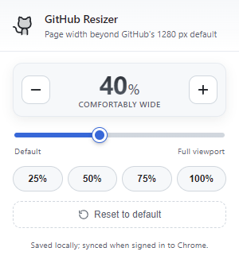

# GitHub Resizer

Browser extension (Firefox **and** Chrome) that widens GitHub pages between the native **1280 px default** and the **full viewport**, in **1 % steps**. The chosen value is persisted in `storage.local` and synced through `storage.sync`, so it follows you across devices when you are signed into your browser account.

> In short: most existing "wide GitHub" extensions answer the question *"narrow or full width?"*. **GitHub Resizer** answers *"how wide?"*.


<p align="center">
  The toolbar popup - slider, presets and reset button.</br></br>
  
</p>

---

## What it does

GitHub's main container (`.container-xl`) is capped at 1280 px. On a 1440p or 4K monitor that leaves large empty margins on every repo, PR, issue and code view.

GitHub Resizer adds a slider to the browser toolbar that lets you smoothly choose any width between GitHub's native default and the full width of your window - not just "on" or "off". Every open GitHub/Gist tab reflows live, without a reload.

The slider value is interpreted as *"how much of the extra space above the 1280 px default should be used"*:

```
width = max(1280px, 1280px + slider/100 * (viewport - 1280px))
```

| Slider | 1280 px viewport | 1920 px viewport | 3840 px viewport |
| --- | --- | --- | --- |
| 0 %   | 1280 (default)        | 1280 (default)   | 1280 (default)   |
| 25 %  | 1280 (viewport bound) | 1440             | 1920             |
| 50 %  | 1280 (viewport bound) | 1600             | 2560             |
| 100 % | 1280 (viewport bound) | 1920 (full)      | 3840 (full)      |

On viewports up to 1280 px the extension produces **exactly the same layout as default GitHub** - no narrowing, no crushed sidebars, no visual change at all.

---

## How it differs from other "Wide GitHub" extensions

Existing extensions in this space are essentially a binary on/off toggle: GitHub's max-width is either removed entirely, or it isn't. GitHub Resizer takes a different approach.

| Feature | **GitHub Resizer** | Other "Wide GitHub" extensions |
| --- | :---: | :---: |
| Width control | Slider (0–100 %, 1 % steps) | On / off toggle |
| Identical to default on ≤ 1280 px screens | Yes | – |
| Live updates, no reload | Yes | – |
| Cross-device sync (`storage.sync`) | Yes | – |
| Widens inner content column on Primer pages [¹](#-why-this-matters) | Yes | Partial / no |
| Keeps README markdown responsive | Yes | – |

### ¹ Why this matters

Modern GitHub pages have two layers: the **outer page frame** (the 1280 px cap) and the **inner content column** (where the file list, README or PR actually lives). Most "wide GitHub" extensions only stretch the outer frame, so you end up with a wide header but a narrow column floating in the middle.

GitHub Resizer removes both limits. GitHub builds those modern pages with the Primer `<PageLayout>` component through CSS Modules, which gives class names a build-specific hash (e.g. `PageLayout-module__contentWrapper--abc123`) that changes on every release - the extension matches them by prefix so it keeps working across GitHub updates.

---

## Install

> Both store listings are currently **under review**. Until they're published, use the unpacked / packaged builds from this repo.

### Firefox

- Store: [addons.mozilla.org/firefox/addon/github-resizer](https://addons.mozilla.org/en-US/firefox/addon/github-resizer/) *(under review)*
- Load unpacked for development:
  1. Open `about:debugging#/runtime/this-firefox`.
  2. **Load Temporary Add-on…** → pick any file inside `Firefox/`.
- Or install the packaged build: `github_resizer-firefox-1.0.0.zip`.

### Chrome / Chromium / Edge / Brave

- Store: [chromewebstore.google.com/detail/mipojddikhienkgpinpppjaaadkgmhlg](https://chromewebstore.google.com/detail/mipojddikhienkgpinpppjaaadkgmhlg) *(under review)*
- Load unpacked for development:
  1. Open `chrome://extensions`.
  2. Enable **Developer mode** (top right).
  3. **Load unpacked** → select the `Chrome/` folder.
  4. Pin the extension from the puzzle icon.
- Or install the packaged build: `github-resizer-chrome-1.0.0.zip`.

### Differences between the Chrome and Firefox builds

Only the platform glue differs; `content/`, `popup/` and the storage-sync logic are identical.

| Area | Firefox | Chrome |
| --- | --- | --- |
| Extension API namespace | `browser.*` | `chrome.*` |
| `browser_specific_settings` (gecko id) | Required | Removed |
| `action.theme_icons` | Supported | Removed (Firefox-only) |
| Icons | SVG | PNGs at 16/32/48/128 |

---

## Storage / Sync

The width is stored under the key `widthPercent` in both `storage.local` (instant, always available) and `storage.sync` (cross-device when signed into your browser account). On load, `sync` wins if it has a value, otherwise `local`, otherwise the default. Changes are pushed to every open GitHub tab without a reload via `storage.onChanged`.

```json
{ "widthPercent": 50 }
```

| Setting | Value |
| --- | --- |
| Minimum | 0 % (= default GitHub) |
| Maximum | 100 % (= full viewport) |
| Step    | 1 % |
| Default | 0 % |

---

## Permissions

- `storage` - remember and sync the chosen width.
- Host access to `github.com` and `gist.github.com` - inject the CSS that widens the layout.

No background service worker, no network requests, no analytics.

## License

MIT.
